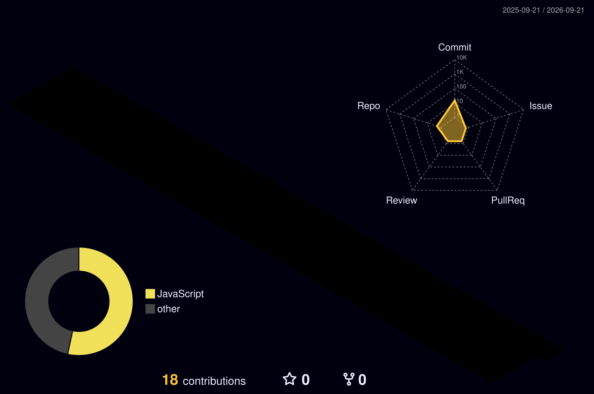

<h1 align="center">Hi 👋, I'm Shaik Abdul Gaffar</h1>
<h3 align="center">A 19-year-old Computer Science student evolving into an AI-Integrated Data Scientist.</h3>

<!-- Dynamic Typing Animation -->

  

<!-- Sleek Contact Badges -->

  
  

---

### 🧠 About Me
- 🔭 I’m currently focused on **advanced data structures, algorithm design, and foundational AI models.**
- 💻 My toolkit bridges the gap between low-level logic (C, Java) and high-level data analysis (Python), all while keeping things visually sharp with HTML.
- 🚀 **Vision:** To become a fully loaded, AI-integrated Data Scientist who builds intelligent systems from the ground up.

---

### 🛠️ My Tech Stack

  

---

### ⛰️ My Contribution Peaks (3D Graph)
<!-- This image will automatically generate and update once you set up the Action in Step 3! -->

  

---

### 📊 Performance Analytics

  
  

  

